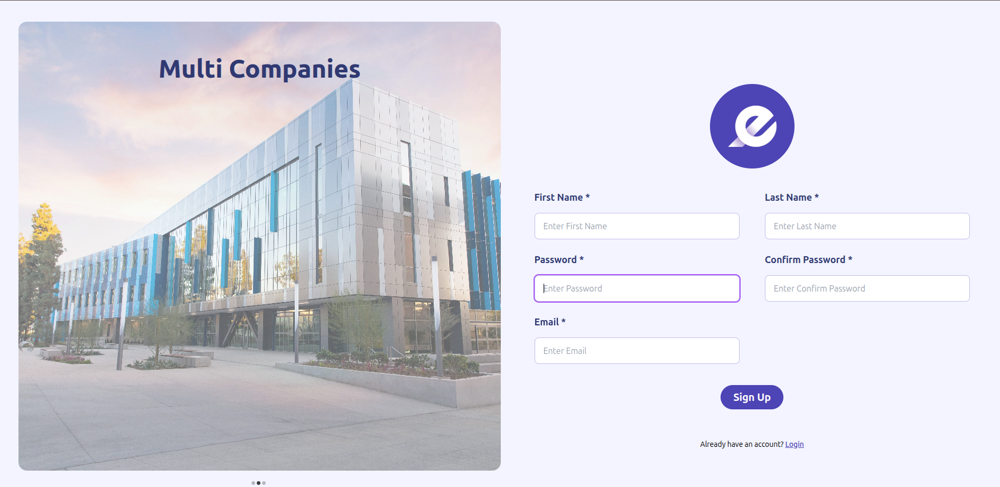

cat > README.md <<'EOF'
# Akedmi

Akedmi is a multi-company management system built with React. It provides a centralized dashboard for managing companies, employees, partners, payroll, projects, inventory, users, and accounting information.

## Features

- User Sign Up and Login
- Dashboard
- Company management
- Employee management
- Partner management
- Payroll management
- Project management
- Inventory management
- User management
- Chart of Accounts
- Settings
- Currency selection
- Date and time selection
- Charts and data visualization
- Local data persistence using IndexedDB
- Client-side routing with React Router

## Tech Stack

- React 19
- React Router 7
- Tailwind CSS
- Axios
- Chart.js
- React Chart.js 2
- React Calendar
- React Icons
- Moment.js
- IndexedDB
- Create React App

## Getting Started

### Prerequisites

Make sure Node.js and npm are installed.

Check the installed versions:

```bash
node -v
npm -v
```

#### Screenshots

