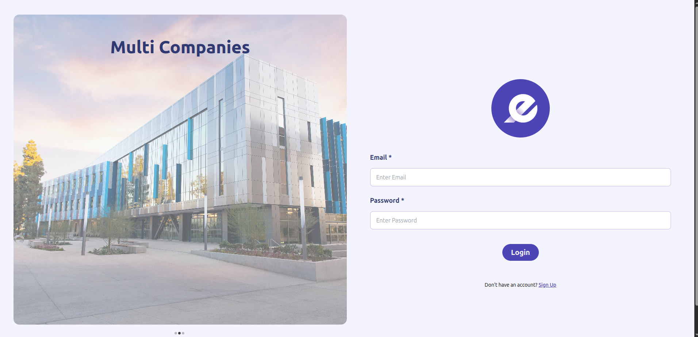
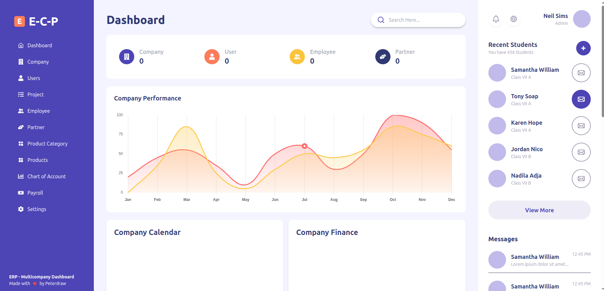
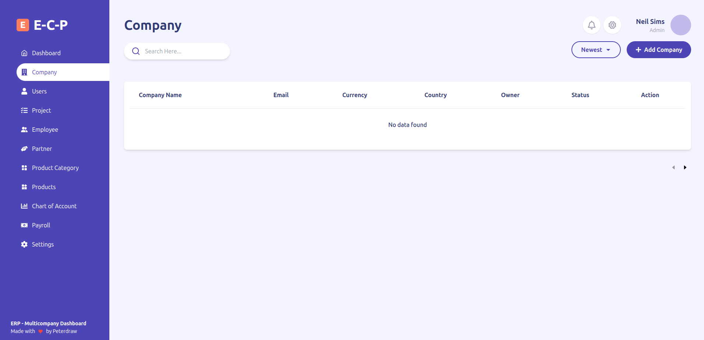
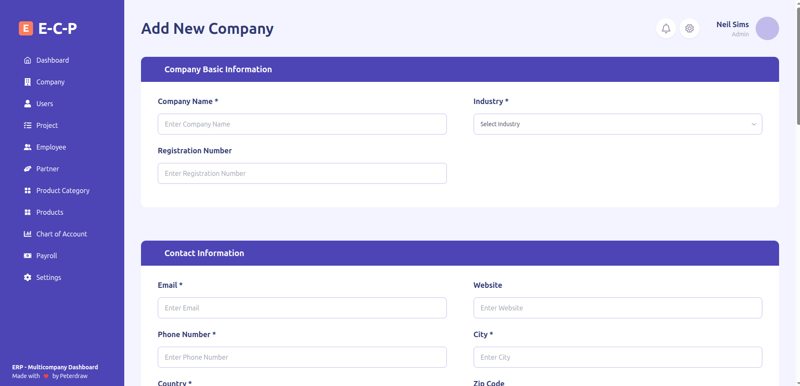
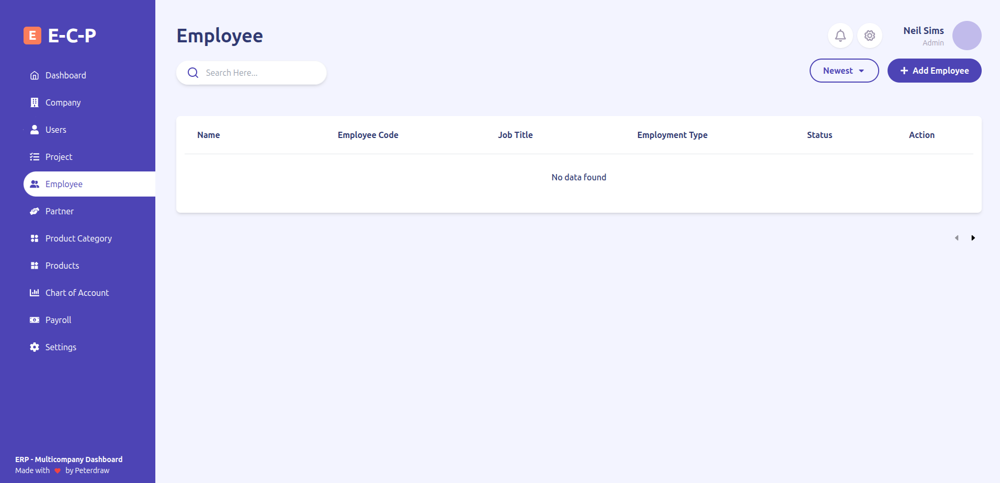
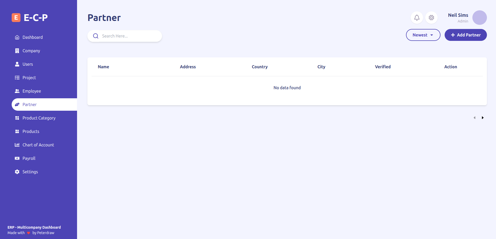
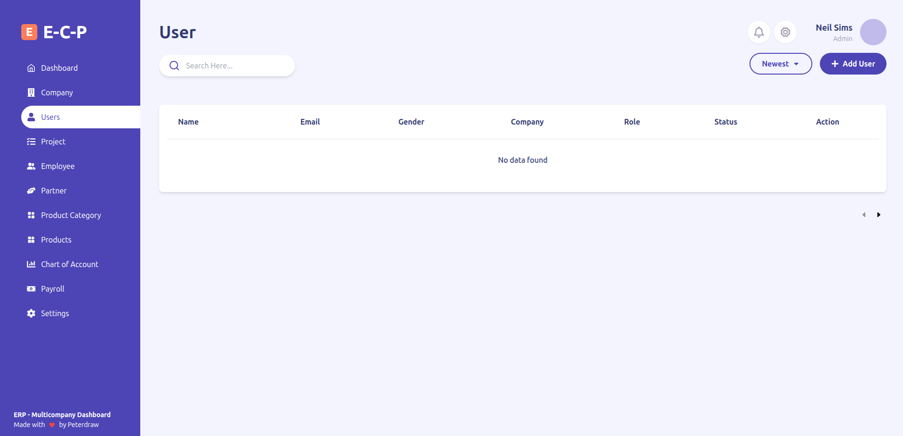

# Akedmi

Akedmi is a multi-company management system built with React. The application provides a centralized interface for managing business operations across companies, employees, partners, payroll, projects, inventory, users, and accounting.

## Features

* User Sign Up and Login
* Dashboard
* Company management
* Employee management
* Partner management
* User management
* Chart of Accounts
* Settings
* Currency selection
* Date and time preferences
* Charts and data visualization
* Local data persistence using IndexedDB
* Client-side routing with React Router

### Modules Under Development

Some modules are currently under development and will be added in future updates:

* Payroll management
* Project management
* Inventory management

## Tech Stack

* React 19
* React Router 7
* Tailwind CSS
* Axios
* Chart.js
* React Chart.js 2
* React Calendar
* React Icons
* Moment.js
* IndexedDB
* Create React App

## Getting Started

### Prerequisites

Make sure Node.js and npm are installed.

Check the installed versions:

```bash
node -v
npm -v
```

### Installation

Clone the repository and navigate to the project directory:

```bash
git clone https://github.com/farina-riaz-fari/Multi-Company.git
cd Multi-Company/akedmi
```

Install the dependencies:

```bash
npm install
```

Start the development server:

```bash
npm start
```

The application will be available at:

```text
http://localhost:3000
```

## Screenshots

<table>
  <tr>
    <td></td>
    <td></td>
  </tr>
  <tr>
    <td></td>
    <td></td>
  </tr>
  <tr>
    <td></td>
    <td></td>
  </tr>
  <tr>
    <td></td>
    <td></td>
  </tr>
</table>
